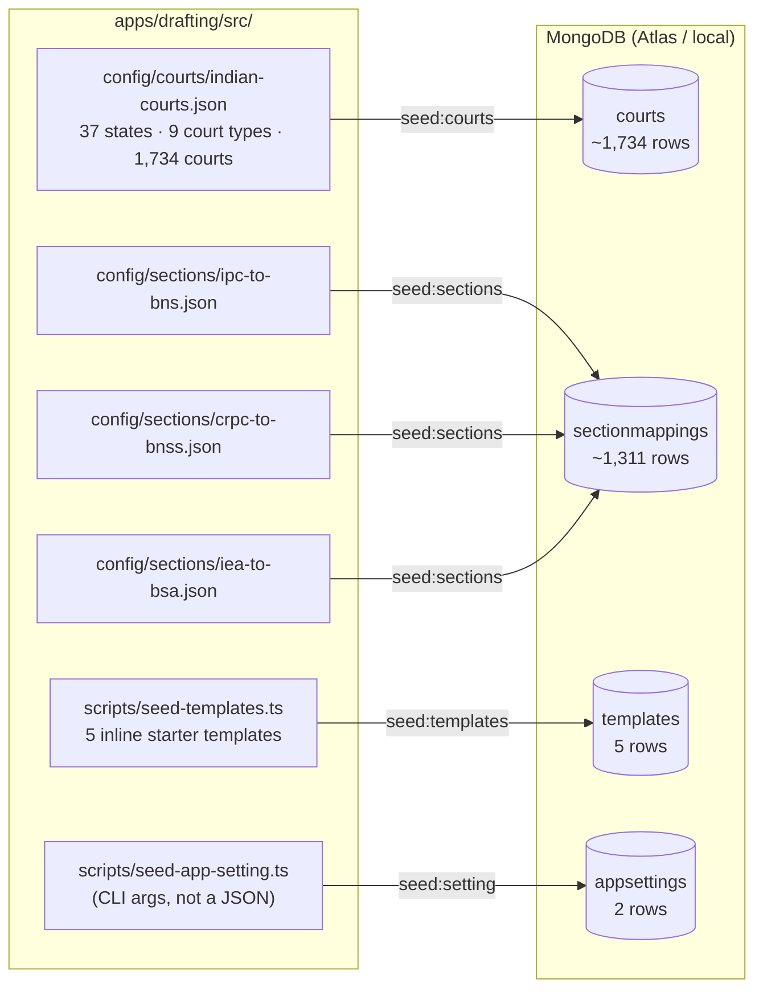
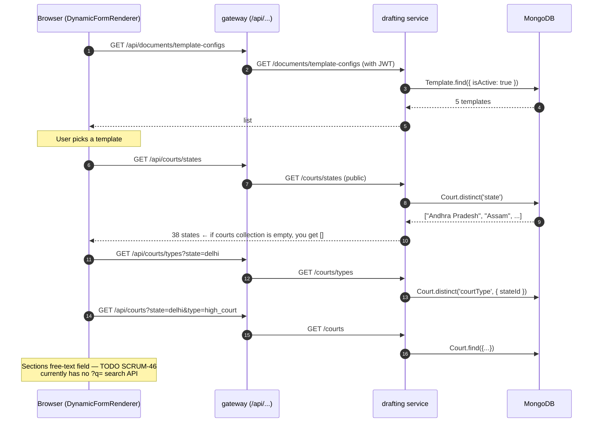

# Seeding the Lawie databases

Reference for every collection that gets populated from a static source file at the repo level. Run these on first boot of a new database (Atlas cluster, EC2 instance, fresh local Mongo) and again any time you change one of the source files in `apps/drafting/src/config/`.

The drafting service reads these collections at runtime — if they are empty, the new-document form has nothing to render and `/api/courts/states` returns `[]`. That is exactly the bug we hit on the demo box on 2026-05-11.

---

## 1. Source files → collections at a glance



What lives in JSON files in the codebase but is **not** seeded — these are read straight from disk at runtime by the drafting service:

- `apps/drafting/src/config/court-rules/*.json` — 15 court-specific formatting rule files (fonts, margins, cause-title format)
- `apps/drafting/src/config/document-rules/*.json` — 5 document-type rule files (bail, S138, etc.)
- `apps/drafting/src/config/bns-bailability.json` and `bns-offences.json` — bail-checker reference
- `apps/billing/src/config/credit-skus.ts` — plan tiers + top-up SKUs powering `/api/billing/plans`

If you change any of these, redeploy the drafting (or billing) service — no DB step needed.

---

## 2. End-to-end data flow for the new-document form

This is the path the user is on when they click "New document" in the dashboard:



The "states dropdown empty" bug means step 5 returned `[]`. The fix is always: run `yarn workspace @lawie/drafting seed:courts` against that DB.

---

## 3. Per-script reference

| Script | npm script | Source | Collection | Idempotent? |
|---|---|---|---|---|
| `seed-courts.ts` | `yarn workspace @lawie/drafting seed:courts` | `config/courts/indian-courts.json` | `courts` | Yes — upsert on `courtId` |
| `seed-sections.ts` | `yarn workspace @lawie/drafting seed:sections` | `config/sections/{ipc-to-bns, crpc-to-bnss, iea-to-bsa}.json` | `sectionmappings` | Yes — skips matches on `(oldCode, oldSection, isNewProvision)`. Pass `--force` to drop and reseed. |
| `seed-templates.ts` | `yarn workspace @lawie/drafting seed:templates` | inline array in the script | `templates` | Yes — skip if `slug` exists |
| `seed-app-setting.ts` | `yarn workspace @lawie/drafting seed:setting <key> <value> [desc]` | CLI args | `appsettings` | Yes — no-op if (key, value) already match |

One-shot bootstrap of a fresh DB:

```bash
# Seeds courts, sectionmappings, templates against whichever MONGO_URI
# is in your .env.development (or NODE_ENV-matched .env file).
yarn workspace @lawie/drafting seed:all

# Set the AI model keys (DB is the only place these live — never in .env)
yarn workspace @lawie/drafting seed:setting ai.drafting_model claude-sonnet-4-6
yarn workspace @lawie/drafting seed:setting ai.preflight_model claude-haiku-4-5-20251001
```

All four scripts read `MONGO_URI` from `.env.${NODE_ENV ?? 'development'}` at the repo root.

---

## 4. Running seeds against demo / production

The demo EC2 box (`13.202.145.184`) runs the drafting service in a Docker container with `.env.demo` mounted. The cleanest way to seed against the demo Mongo is to exec into the container so it inherits the right `MONGO_URI`:

```bash
ssh -i lawie-demo-key.pem ubuntu@13.202.145.184
cd /home/ubuntu/lawie

# Option A — from inside the container (no env wiring needed)
docker exec lawie_drafting node dist/scripts/seed-courts.js
docker exec lawie_drafting node dist/scripts/seed-sections.js
docker exec lawie_drafting node dist/scripts/seed-templates.js

# Option B — from the host with the demo MONGO_URI in scope
docker exec -i lawie_drafting sh -c \
  'MONGO_URI=$MONGO_URI npx ts-node src/scripts/seed-courts.ts'
```

(The compiled `dist/scripts/*.js` files exist because `tsc` is part of the Docker image build.)

> ⚠️ **Demo and dev currently share one Atlas cluster** (`lawie-dev.bdyi886.mongodb.net`). Seeding "demo" is the same as seeding "dev" today. Before launching paying users we need a separate `lawie-prod` cluster and `.env.demo` updated accordingly — see [docs/environments.md](environments.md).

---

## 5. When to re-run each seed

| Source change | Re-run |
|---|---|
| Adding rows to `indian-courts.json` | `seed:courts` |
| Editing existing court name / formattingRulesRef in JSON | `seed:courts` (upsert overwrites) |
| Deleting a court from JSON | `seed:courts` does **not** delete — handle manually in Mongo |
| Adding a new IPC↔BNS row | `seed:sections` |
| Changing existing section mapping | `seed:sections --force` (drops all, reseeds) |
| Adding a starter template | `seed:templates` |
| Editing an existing template | Update the doc in Mongo directly, or delete + reseed |
| AI model swap (Anthropic releases new model) | `seed:setting ai.drafting_model <new-id>` |

---

## 6. Verifying a seed worked

```bash
# Count check
docker exec lawie_drafting node -e "
  require('mongoose').connect(process.env.MONGO_URI).then(async (m) => {
    const db = m.connection.db;
    for (const c of ['courts','sectionmappings','templates','appsettings']) {
      console.log(c.padEnd(20), await db.collection(c).countDocuments());
    }
    await m.disconnect();
  });
"

# Public API check (no auth needed)
curl -sk https://demo.lawie.in/api/courts/states | jq '.states | length'   # expect 38
curl -sk https://demo.lawie.in/api/sections/all/IPC | jq '. | length'      # > 500
```

After a successful seed the new-document form should show the full state dropdown, the court-type dropdown should populate when you pick a state, and the template list should have 5 entries.
