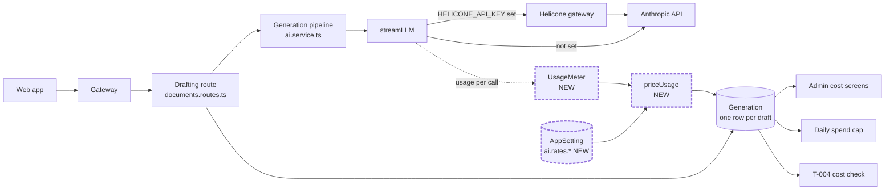
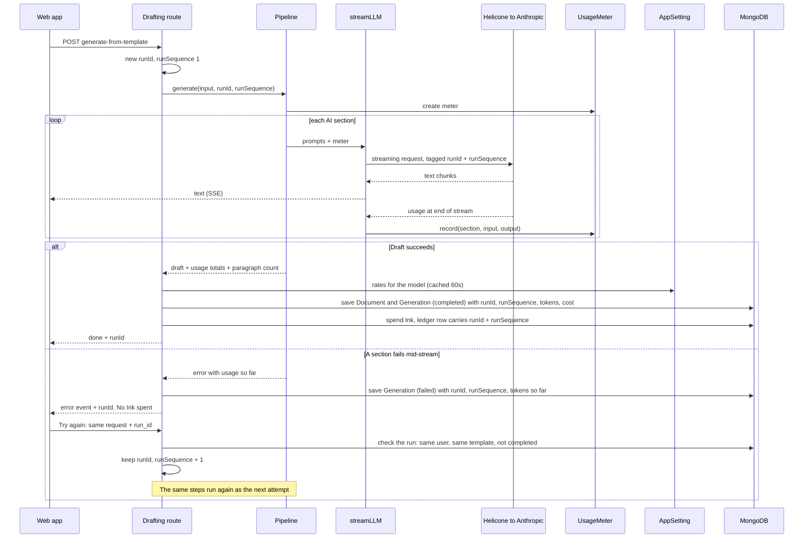
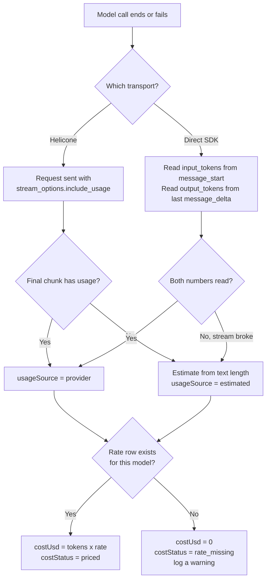
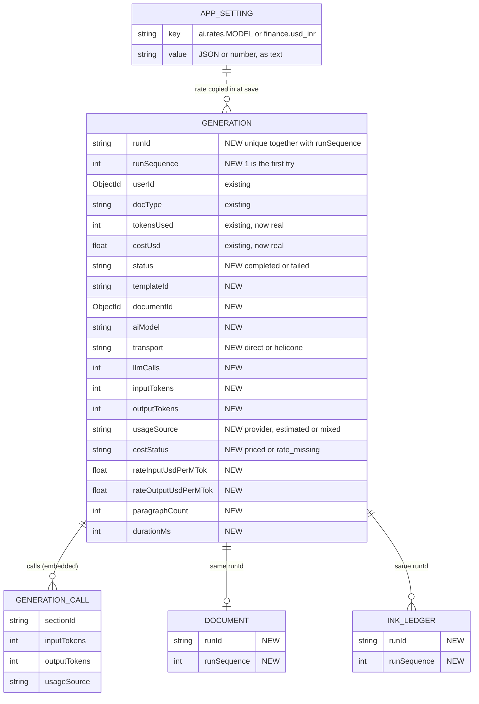

# T-003 design: record real token usage

| Field       | Value                                                                                                                                                    |
| ----------- | -------------------------------------------------------------------------------------------------------------------------------------------------------- |
| Status      | Approved by the founder on 3 Oct 2026, with two additions: a run ID and a run sequence for every generation (section 3.8). Production uses Helicone only |
| Author      | Arjun (CTO)                                                                                                                                              |
| Reviewed by | Vikram (rates), Ajay (prompt boundary)                                                                                                                   |
| Ticket      | `handoff/tickets/T-003-record-real-token-usage.md`                                                                                                       |
| Date        | 2026-10-03                                                                                                                                               |

## 1. What this changes, and what it does not

- Every draft records the tokens it really used and what that cost us.
- It does **not** change what a user is charged. Ink amounts and rules are untouched. The only edit near Ink is one optional field, `runId`, stored on Ink ledger rows.
- Every draft gets a run ID, and every attempt at it gets a run sequence (1 for the first try, 2 for the first retry). One draft can be traced across logs, the database, the Ink ledger and Helicone, retries included.
- It does **not** change any prompt. That is the condition on Ajay's sign-off.
- A problem in usage recording must never block, slow or fail a draft.

## 2. What exists today

- `streamLLM` in `apps/drafting/src/services/ai.service.ts` has two transports. If `HELICONE_API_KEY` is set it calls the Helicone gateway (OpenAI-compatible) with `fetch`. Otherwise it calls Anthropic through the SDK. Both yield text only and drop the usage numbers.
- The template pipeline (`streamGenerateFromTemplate`) calls `streamLLM` once per `ai_generated` section with `max_tokens` 8192. The legacy pipeline (`streamGenerateDocument`) calls it once with 4096.
- Both routes in `documents.routes.ts` write one `Generation` row per successful draft with `tokensUsed: 0`. `costUsd` stays at its default of 0. A failed draft writes no row.
- `Generation` is read in five places: two admin cost screens, the daily spend cap, the free-limit check, and `GET /documents/usage`. The last two count rows.
- Settings live in `AppSetting`: string key (120 chars, letters, digits, `.`, `_`, `-`), string value (500 chars), 60-second cache. `getAppSetting` throws when a key is missing.
- The template pipeline already counts numbered body paragraphs (`bodyParaCount` in `assembleDocument`).
- There is no run ID, request ID or trace ID anywhere in the code today. Searched all apps for `runId`, `requestId`, `x-request-id`, `traceId` and `uuid`.

## 3. Design

### 3.1 Components

New code sits in one file, `apps/drafting/src/services/llm-usage.ts`:

- `UsageMeter`: collects usage for every model call in one request.
- Two pure parsers: one for Anthropic stream events, one for OpenAI-style stream lines. They take plain data, so they are tested without a network.
- `priceUsage(usage, rates)`: tokens to US dollars.
- `getModelRates(model)`: reads the rate row for a model. It never throws.

### 3.2 One draft, start to finish

### 3.3 Where usage is read on each path

- **Direct path.** The code already loops over stream events. It adds two cases: `message_start` carries `input_tokens`, and `message_delta` carries a cumulative `output_tokens`. Reading them in the loop also works when the stream breaks half-way.
- **Helicone path.** The request adds `stream_options: { include_usage: true }`. In the OpenAI format the last chunk then carries `usage.prompt_tokens` and `usage.completion_tokens`. **Not confirmed for this gateway** (see section 5).
- **Estimates.** When the provider gives no number, output tokens are estimated from the text received. Those rows are marked `estimated` and left out of the T-004 check.

### 3.4 Data model

- All new fields are optional, so old rows stay valid. Old rows have no `status` and are treated as completed.
- `tokensUsed` = `inputTokens` + `outputTokens`. The admin screens and the spend cap keep their queries.
- The rate is copied onto the row, so a later rate change does not rewrite history. Because tokens are stored, a row saved with `rate_missing` can be priced later.
- `calls` holds one small entry per section. It shows how much of the cost is the repeated system prompt, which T-004 needs.
- `paragraphCount` uses the count the pipeline already makes: numbered paragraphs in the AI body. T-206 may change the definition.
- The field is named `aiModel` to avoid a clash with Mongoose's own `model` member on documents.
- No prompt text and no draft content is stored or logged anywhere in this design.

### 3.5 Rates in AppSetting

One row per model. The value is a small JSON text, well inside the 500-character limit.

| Key                     | Value                                               | Set by |
| ----------------------- | --------------------------------------------------- | ------ |
| `ai.rates.<model-slug>` | `{"input_usd_per_mtok":3,"output_usd_per_mtok":15}` | Vikram |
| `finance.usd_inr`       | `96.5`                                              | Vikram |

- `<model-slug>` is the exact text in `ai.drafting_model`, lower-cased, with any character outside `a-z 0-9 . _ -` replaced by `-`. Example: `claude-sonnet-4/anthropic` becomes `ai.rates.claude-sonnet-4-anthropic`. Helicone model names can contain `/`, which a setting key cannot.
- The example numbers are Claude Sonnet 4 list prices in US dollars per million tokens. Vikram confirms the real values before seeding.
- Two optional fields, `cache_write_usd_per_mtok` and `cache_read_usd_per_mtok`, are read if present. Nothing uses prompt caching today.
- The value is checked on read. A missing or malformed row means "rate missing". It never throws and never blocks a draft.
- No rate lives in code or in env files, in line with the founder's rule for AI config.
- The existing admin page lists and edits any setting row, so no web change is needed to edit a rate. The first insert is a `PUT /admin/app-settings/:key` call.

### 3.6 Failures

| Case                        | What is saved                                            | Ink                 |
| --------------------------- | -------------------------------------------------------- | ------------------- |
| Draft succeeds              | `Generation`, status completed, real tokens and cost     | Spent, as today     |
| Stream breaks mid-way       | `Generation`, status failed, tokens used so far          | Not spent, as today |
| Usage missing from provider | Row saved, tokens estimated, marked `estimated`          | Unchanged           |
| Rate row missing            | Row saved with tokens, cost 0, marked `rate_missing`     | Unchanged           |
| Saving the row fails        | Error logged. The draft still reaches the user, as today | Unchanged           |

### 3.7 Changes to the code that reads Generation

- **Admin cost screens** (`admin-documents.routes.ts`, two places): cost sums include failed rows, because we paid for them. Draft counts exclude failed rows. The rupee rate comes from `finance.usd_inr`, falling back to today's 85 until that row is set.
- **Free-limit check and `GET /documents/usage`**: both count rows, so both add "status is not failed". Without this, a failed draft would use up a free user's allowance.
- **Daily spend cap** (`spendCap.ts`): starts seeing real cost. It stays log-only. Its per-user query matches a text user id against an ObjectId field, and Mongoose does not convert values inside `aggregate`, so it likely never matches. T-003 adds a test with a text id and fixes it by converting the id.

### 3.8 Run ID and run sequence (added by the founder)

- **`runId`** identifies one draft the user is trying to produce. It stays the same across retries.
- **`runSequence`** is the attempt number inside that run: 1 for the first try, 2 for the first retry, and so on.
- The pair (`runId`, `runSequence`) is unique. Neither exists in the code today.

How a retry keeps the same run:

1. First attempt: the drafting route creates the `runId` with `crypto.randomUUID()` (built into Node, no new dependency) and sets `runSequence` to 1. This happens once the request has passed validation, just before the pipeline starts.
2. If the attempt fails, the browser gets the `runId` in the `error` event.
3. The "Try again" button resends the same request with `run_id` added.
4. The server checks the run before trusting it: a `Generation` row with that `runId` exists, it belongs to the same user and the same template, and no attempt in the run has completed.
5. If the check passes, the server sets `runSequence` to the highest so far plus 1. If it fails, the server quietly starts a new run at sequence 1. It never returns an error for a bad `run_id`.

Rules:

- The browser never sends the sequence. The server works it out.
- A run ends at its first completed attempt. Generating again after a success is a new run.
- If the user edits the form after a failure, the web page drops the stored `runId`, so the next attempt is a new run. The server cannot see that, so this is the web page's job.
- Once a `runId` exists, every way the request can fail returns it and saves a failed row.
- Only the successful attempt spends Ink, as today.
- Whether a regeneration (T-205) continues the run or starts a new one is decided in T-205.

Where the two values go:

| Place                   | How                                                                                                | Why                                               |
| ----------------------- | -------------------------------------------------------------------------------------------------- | ------------------------------------------------- |
| `Generation`            | `runId` and `runSequence`, with a unique index on the pair (sparse, because old rows have neither) | One cost row per attempt                          |
| `Document`              | `runId` and the `runSequence` of the attempt that produced it                                      | From a saved draft, find the run that made it     |
| `inkledger` rows        | `spendInk` takes both as optional values and stores them                                           | Which draft did this Ink pay for                  |
| Log lines               | Every log line in the generation path includes both                                                | Search server logs for one draft                  |
| Response to the browser | `X-Run-Id` and `X-Run-Sequence` headers, and inside the `done` and `error` events                  | A reference the user can quote to support         |
| Helicone                | `Helicone-Property-Run-Id` and `Helicone-Property-Run-Sequence` on each model call                 | Match our rows to Helicone's and cross-check cost |

- The full cost of a draft, failed attempts included, is the sum of the rows that share one `runId`. T-004 uses this.
- `spendInk` is the one place this design touches `credits.service.ts`. The change is two optional values passed through to the ledger rows. No amount, bucket order or condition changes, and the reviewer checks that.
- The request schema gains one optional field, `run_id`, which must be a UUID.
- One web change is needed: `apps/web/src/app/dashboard/new/page.tsx` keeps the `runId` from the `error` event, sends it in `handleRetry`, and clears it when the form changes. Web has no tests, so the PR carries manual checks.
- The `runId` is random and carries no user data.
- Not linked yet: preflight calls and, later, intake calls happen in separate requests. The T-006 ADR decides whether they share the run.
- Not included: showing the run ID on screen.

## 4. Decisions (approved by the founder, 3 Oct 2026)

| #   | Decision                   | Recommended                                                                 | Alternative                                              |
| --- | -------------------------- | --------------------------------------------------------------------------- | -------------------------------------------------------- |
| D1  | Where usage is stored      | Extend `Generation`, one row per draft, with a small embedded list of calls | A new collection with one row per model call             |
| D2  | Shape of rates             | One JSON row per model                                                      | One row per number, for example `ai.rates.<model>.input` |
| D3  | Failed drafts              | Save a `Generation` row with status failed                                  | Do not record failures                                   |
| D4  | Preflight and intake calls | Leave out of T-003. Design them in the T-006 ADR                            | Add a per-call collection now                            |
| D5  | If Helicone gives no usage | Estimate, mark the row, and exclude it from T-004                           | Send drafting direct to Anthropic                        |

All five were approved as recommended.

Why these: D1 keeps the admin screens and the spend cap working with no new queries. D2 keeps a model's two numbers together, so one cannot be updated without the other. D3 is real money and T-004 should see it. D4 keeps this ticket small. D5 depends on the spike in section 6.

## 5. Risks and unknowns

- **Helicone and streamed usage.** Helicone's gateway guide does not say whether it returns usage in a streamed response. The spike in step 0 settles it, and it is the first thing to do.
- **Production uses Helicone only** (founder, 3 Oct 2026). So the Helicone spike decides whether production rows hold real numbers. If Helicone returns no streamed usage, every production row would be an estimate and T-004 would have nothing to check. In that case T-004 takes tokens and cost from Helicone's own records, matched by the run ID property, or drafting moves to the direct path. The direct path stays in the code for dev.
- **`ai.service.ts` is legal content.** Only `streamLLM`, the result types and the error class may change. The prompt builders live in other files and are not touched. The reviewer confirms that no prompt string appears in the diff.
- **Estimates are rough.** A character-based estimate is worse for Hindi and bilingual drafts, which is why estimated rows are excluded from T-004.
- **Rupee conversion.** Costs are stored in dollars. Rupees are worked out at read time, so a rate change shifts all past rupee figures together.

## 6. Build order for Vishal

0. **Spike, about 30 minutes.** In dev, make one real call through Helicone, the production path, and confirm usage arrives in the stream. Then do the same on the direct path. Write the result into the ticket. If Helicone gives none, stop and bring it back to the founder before building.

   **Result (3 Oct 2026, Vishal):** Confirmed on both paths with real calls.
   - Direct Anthropic SDK: `message_start.message.usage.input_tokens` and `message_delta.usage.output_tokens` both present, as documented.
   - Helicone gateway: usage **is** returned in the final streamed chunk with `stream_options: { include_usage: true }` — but only when the `model` field sent to the gateway is a full dated model id (e.g. `claude-sonnet-4-5-20250929`). A bare alias (e.g. `claude-sonnet-4-5`) combined with an explicit `/anthropic` provider suffix either 500s ("No available providers") or makes the gateway switch to returning Anthropic's native event shape instead of the OpenAI-compatible one — a different response format entirely, not just missing usage. The dated id works identically with or without the `/anthropic` suffix.
   - **Consequence for `ai.drafting_model`:** must be seeded with the full dated model id, not a bare alias, or Helicone usage parsing silently breaks (either an error or a shape the OpenAI-compatible parser can't read). Worth a one-line note on the admin settings UI or seed script.
   - Go/no-go: **go** — building to the design as written, OpenAI-compatible parser only. The native-Anthropic-shape fallback parser design mentions in 3.1 is not needed for the model-id convention this app already uses (dated ids), so it's left out unless a future model alias forces it.

1. `llm-usage.ts`: types, meter, two parsers, slug, `priceUsage`, `getModelRates`, with unit tests.
2. Wire `streamLLM` and both pipelines. The result carries usage. `GenerationFailedError` carries usage so far. The route creates the `runId` or accepts a checked `run_id`, works out `runSequence`, and passes both down; they go into log lines, the Helicone headers, the response headers and the `done` and `error` events.
3. `Generation` model fields, including `runId` and `runSequence` with a unique index on the pair. The same two fields on `Document`. `spendInk` passes both to the ledger rows. Both routes write the row, on success and on failure.
4. Readers: admin screens, the two count filters, the spend-cap id fix. The web retry sends `run_id`.
5. Seed the rate rows in dev, generate one real draft, and check the row by hand.

   **Result (3 Oct 2026, Vishal):** Done. Seeded `ai.rates.claude-haiku-4-5-20251001` (`{"input_usd_per_mtok":1,"output_usd_per_mtok":5}`, marked PLACEHOLDER pending Vikram) and `finance.usd_inr` (`87`, same caveat). Ran one real `affidavit_identity` generation through the live dev stack (real Helicone call, real tokens). Resulting `Generation` row by hand:
   - `inputTokens: 1599, outputTokens: 907, costUsd: 0.006134` — matches `(1599/1e6)×1 + (907/1e6)×5` exactly.
   - `status: completed, aiModel: claude-haiku-4-5-20251001, transport: helicone, usageSource: provider, costStatus: priced, llmCalls: 1`, one `calls` entry for section `body`, `paragraphCount: 10`, `durationMs: 11593`.
   - `runId`/`runSequence: 1` matched across the `Generation` row, the `Document` row, and the `inkledger` spend row — the full cross-system trace the design asks for, confirmed with a real draft, not a mock.
   - Placeholder rate values need Vikram's real numbers before this is production-ready; nothing else about the mechanism is in question.

Two pull requests: steps 1 to 3 (capture and store), then step 4 (readers). Step 5 follows the first.

Tests that must exist:

- Each parser: a normal stream, a stream with no usage, and a stream that breaks.
- `priceUsage`: known tokens and rates give the expected dollars.
- The slug rule, including a model name with `/`.
- A missing and a malformed rate row both give `rate_missing` and do not throw.
- Route level: a successful draft writes real numbers; a failed draft writes a failed row and spends no Ink.
- Count readers ignore failed rows. The spend cap matches a text user id.
- Run ID: two separate drafts get different IDs. The same `runId` and `runSequence` are on the `Generation` row, the `Document`, the ledger row, the response headers and the `done` event.
- Retry: a failed attempt followed by a retry with `run_id` gives two rows with one `runId` and sequences 1 and 2. A `run_id` from another user, another template, an unknown run or a completed run starts a new run at 1 and returns no error. The browser cannot set the sequence.
- `spendInk` charges the same amount with and without the two values.

## 7. Out of scope

- Any prompt change, and prompt caching.
- Recording preflight or intake calls (D4).
- Turning the spend cap into a hard block.
- Any change to Ink amounts, drops or what the user pays.
- A request ID for every API call across the gateway. The run ID covers generations only.
- Any web change other than the retry sending `run_id`. A "rate missing" warning on the admin page can be a later ticket.

## Sources

- [Anthropic streaming docs](https://platform.claude.com/docs/en/build-with-claude/streaming): usage in `message_start` and cumulative `output_tokens` in `message_delta`.
- [Helicone gateway guide](https://www.helicone.ai/blog/how-to-gateway): model naming such as `claude-sonnet-4/anthropic`. It does not cover streamed usage.
