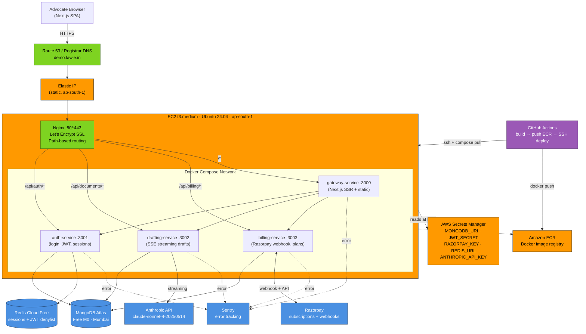

# Lawie — Phase 1 AWS Architecture

**Region:** ap-south-1 (Mumbai) | **Topology:** Single-node Docker Compose on EC2 | **Owner:** Arjun (CTO)

## Request flow caption

An advocate hits `demo.lawie.in`, which resolves via DNS to the Elastic IP fronting our single `t3.medium` EC2 in `ap-south-1`. Nginx terminates TLS (Let's Encrypt) and path-routes the request: `/api/auth/*` to auth-service, `/api/documents/*` to drafting-service (which streams Claude Sonnet 4 tokens back via SSE), `/api/billing/*` to billing-service (Razorpay webhooks + subscription state), and everything else to the Next.js gateway-service. All four services share a Docker Compose network, read secrets from AWS Secrets Manager at boot, persist to MongoDB Atlas (M0, Mumbai), use Redis Cloud for sessions and JWT denylist, and emit errors to Sentry. CI/CD: GitHub Actions builds and pushes images to ECR, then SSHes into EC2 to run `docker compose pull && up -d`.

## Phase 2 migration trigger (single-node → ECS Fargate)

Migrate off single-EC2 Docker Compose to ECS Fargate (or EKS) when **any one** of the following hits:

| Trigger | Threshold |
|---|---|
| Concurrent active drafters | > 50 sustained |
| EC2 CPU p95 | > 70% for 7 consecutive days |
| Drafting-service p95 latency | > 8s (excluding LLM) |
| Paying users | > 100 |
| Single-host downtime impact | First customer-reported outage |

Until then, vertical scale (`t3.medium` → `t3.large` → `m6i.large`) is cheaper, simpler, and faster to recover than orchestration overhead.

---

*Diagram source: maintained by Arjun (CTO). Notion: Engineering › Architecture › Phase 1 Topology.*
